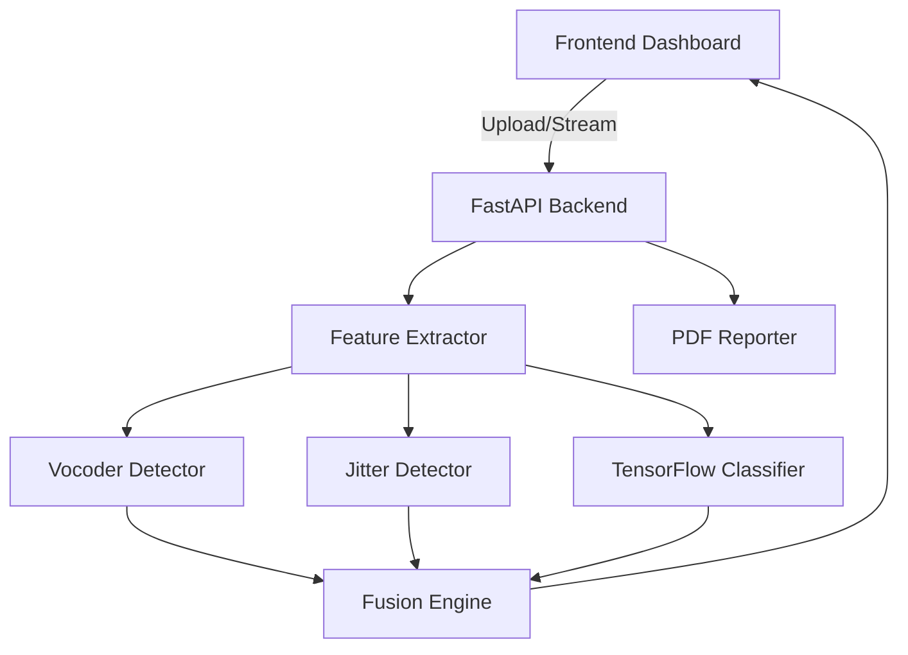
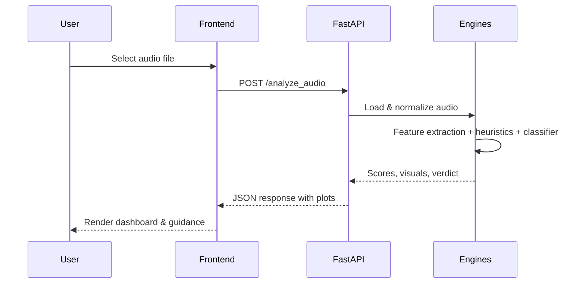

# Real-Time Audio Deepfake Detection System (RTADDS)

An educational, privacy-preserving reference implementation for detecting synthetic voice (vishing) attempts in near real time. RTADDS ingests user-provided or synthetic audio, extracts forensic features with Librosa/NumPy, runs lightweight TensorFlow classification, fuses evidence, and renders dashboards plus PDF reporting. The system is self-contained: no external audio collection or third-party APIs.

## Highlights
- **Multi-channel ingestion**: File uploads (WAV/MP3) and simulated WebRTC streaming with 400 ms windows at 16 kHz.
- **Forensic feature engine**: Mel spectrograms, MFCC, chroma, spectral centroid, ZCR, harmonic-noise ratio, jitter/shimmer proxies, and anomaly maps for artifact localization.
- **Synthetic heuristics**: Vocoder fingerprinting and micro-jitter analysis to surface over-smoothed or phase-coherent regions typical of voice cloning.
- **ML classifier**: Lightweight Keras MLP trained on synthetic data (with heuristic fallback when TensorFlow is unavailable), cached on disk for repeatability.
- **Fusion & verdicts**: Combines heuristics, classifier scores, and SNR/flatness metrics into a risk score and verdict (SAFE/SUSPICIOUS/MALICIOUS) with explanations.
- **Visuals & reporting**: Waveform, spectrogram, jitter plots, artifact heatmaps, and PDF summaries aligned to governance guidance.

## Architecture


### Component Map
- `backend/main.py` – FastAPI application setup, routing, and static asset mounting.
- `backend/api/` – HTTP endpoints for audio analysis, streaming simulation, and PDF export with Pydantic schemas.
- `backend/engines/` – Feature extraction, vocoder/jitter heuristics, TensorFlow classifier, and fusion logic.
- `backend/utils/` – Audio loading/segmentation, visualization (base64 PNGs), logging, and PDF generation helpers.
- `frontend/` – Minimal dashboard (HTML/JS/CSS) for uploads and visualization rendering.
- `tests/` – Pytest suites for API smoke coverage and utility validation.
- `.github/workflows/ci.yml` – CI pipeline running lint (ruff/black) and tests.

## Getting Started
1. **Install system prerequisites**
   ```bash
   sudo apt-get update && sudo apt-get install -y libsndfile1
   ```
2. **Create environment & install dependencies**
   ```bash
   python -m venv .venv
   source .venv/bin/activate
   pip install --upgrade pip
   pip install -r requirements.txt
   pip install -r requirements-dev.txt  # linting/tests
   ```
   Or use the bundled helper targets:
   ```bash
   make dev       # installs runtime + dev dependencies
   make lint      # ruff + black checks
   make test      # pytest suite
   ```
3. **Run the API**
   ```bash
   uvicorn backend.main:app --reload
   ```
4. **Open the dashboard** at `http://localhost:8000/frontend/index.html`.

## Usage
- **Analyze an audio file**
  ```bash
  curl -X POST "http://localhost:8000/analyze_audio" \
       -H "Content-Type: multipart/form-data" \
       -F "file=@sample.wav"
  ```
- **Simulated streaming**
  ```bash
  curl -X POST http://localhost:8000/stream/start -H "Content-Type: application/json" -d '{"session_id": "demo"}'
  curl -X POST http://localhost:8000/stream/chunk -H "Content-Type: application/json" -d '{"session_id": "demo", "samples": [0.01, 0.02]}'
  curl -X POST http://localhost:8000/stream/stop -H "Content-Type: application/json" -d '{"session_id": "demo"}'
  ```
- **Generate a PDF report**
  ```bash
  curl -X POST http://localhost:8000/report \
       -H "Content-Type: application/json" \
       -d '{"summary": {"verdict": "SAFE"}, "scores": {"risk": 21.5}}'
  ```

### Docker
Build and run the API in an isolated container:
```bash
docker compose up --build
# or without hot reload
docker build -t rtadds .
docker run --rm -p 8000:8000 rtadds
```

## API Reference
See [API.md](API.md) for endpoint contracts, schemas, and sample payloads.

## Safety & Governance
- Processes only **synthetic or user-supplied** audio; no scraping or phone interception.
- Runs entirely **locally**; no third-party audio APIs.
- Implements logging, input validation, and deterministic synthetic training to align with **NIST AI RMF**, **ISO/IEC 42001**, and **Australian Scamwatch** themes.
- Provides explanations and evidence to keep humans in the loop and discourage over-reliance on automated decisions.

## Development
- Format & lint: `black .` and `ruff check .`
- Tests: `pytest`
- Artefacts: models saved to `models/`, logs in `logs/`, generated reports in `assets/`.

## Diagram: Request Lifecycle


## Contributing & Support
- Follow the [Code of Conduct](CODE_OF_CONDUCT.md) and [Contributing Guide](CONTRIBUTING.md).
- Security issues: review [SECURITY.md](SECURITY.md).
- Architecture deep-dive: [ARCHITECTURE.md](ARCHITECTURE.md).

## License
This project is licensed under the terms of the [LICENSE](LICENSE) file.
